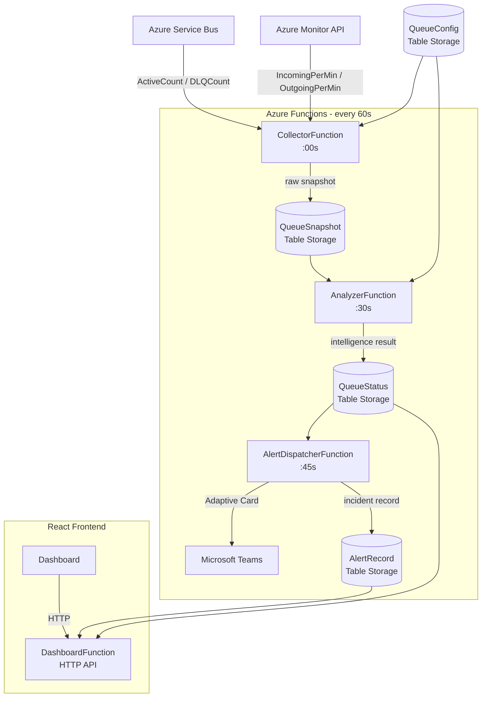

# Queue Backlog Intelligence System

> Real-time monitoring and alerting for Azure Service Bus queues — detects SLA breaches, classifies root causes, and surfaces actionable insights through a live dashboard.


---

## The Problem

When a Service Bus queue backs up, on-call engineers face three hard questions with no fast answers:

- **Is this a real breach or a blip?**
- **Why is it growing — producer spike or consumer failure?**
- **How long until SLA is breached?**

QBIS answers all three automatically, in under 10 seconds on the dashboard.

---

## Screenshots

### Live Dashboard


### Incident Alert Banner


### Historical Chart with Root Cause Timeline


---

## Architecture



> See [docs/ARCHITECTURE.md](docs/ARCHITECTURE.md) for full system design details.

---

## Key Features

| Feature | Description |
|---|---|
| **SLA Breach Detection** | Warning at 60% · Critical at 100% · Predictive warning before breach |
| **Root Cause Classification** | ConsumerStopped · ProducerSpike · ConsumerSlowdown · DLQGrowth |
| **Wait Time Calculation** | Exact minutes a message will wait — `ActiveCount ÷ OutgoingRate` |
| **Trend Detection** | Growing · Draining · Stable · Idle based on delta analysis |
| **Alert Deduplication** | New · Escalation · Reminder · Recovery — no duplicate noise |
| **Sticky Severity** | Requires 2 consecutive OK readings before de-escalation |
| **Live Dashboard** | Two-panel chart · Severity bands · Root cause timeline · Incident table |
| **Docker Support** | Single `docker-compose up` runs frontend + backend |

---

## Tech Stack

| Layer | Technology |
|---|---|
| Backend | C# · .NET 8 · Azure Functions v4 Isolated Worker |
| Data | Azure Table Storage · Azure Service Bus · Azure Monitor |
| Frontend | React 18 · Vite 6 · Recharts · Tailwind CSS v4 |
| Infrastructure | Docker · nginx · Azure Functions Docker image |
| Alerting | Microsoft Teams Adaptive Cards |

---

## Project Structure

```
QueueBacklogIntelligence/
├── docker-compose.yml
├── backend/
│   ├── Dockerfile
│   ├── Functions/
│   │   ├── CollectorFunction.cs         # Timer :00 — collects raw metrics
│   │   ├── AnalyzerFunction.cs          # Timer :30 — runs intelligence pipeline
│   │   ├── AlertDispatcherFunction.cs   # Timer :45 — sends Teams alerts
│   │   └── DashboardFunction.cs         # HTTP — 6 REST endpoints
│   ├── Services/
│   │   ├── CollectorService.cs
│   │   ├── AnalyzerService.cs           # 9-step intelligence pipeline
│   │   ├── AlertService.cs
│   │   └── Repository.cs
│   └── Models/
└── frontend/
    ├── Dockerfile
    ├── nginx.conf
    └── src/
        ├── pages/Dashboard.jsx
        └── components/
            ├── StatusRow.jsx            # 4 live KPI tiles
            ├── ActiveCountChart.jsx     # Two-panel synchronized chart
            ├── IncidentBanner.jsx       # Full-width alert bar
            ├── RootCauseTimeline.jsx    # Colour-coded cause strip
            └── IncidentTable.jsx        # Filterable incident history
```

---

## Quick Start

### Option A — Docker (recommended)

```bash
cp .env.example .env
# Fill in AzureWebJobsStorage, StorageConnectionString, ServiceBusConnectionString

docker-compose up --build
```

| Service | URL |
|---|---|
| Dashboard | http://localhost:3000 |
| API | http://localhost:7071/api |

### Option B — Local development

**Prerequisites:** .NET 8 SDK · Azure Functions Core Tools v4 · Node.js 18+

```bash
# Backend
cp backend/local.settings.json.example backend/local.settings.json
# Fill in connection strings
cd backend && func start

# Frontend (new terminal)
cd frontend && npm install && npm run dev
```

---

## Azure Setup

### Required resources

- Azure Storage Account — for Table Storage + Functions host state
- Azure Service Bus namespace with at least one queue
- Microsoft Teams incoming webhook (optional — for alerts)

### Storage tables

Create these tables in your Azure Storage Account:

| Table | Purpose |
|---|---|
| `QueueConfig` | Monitoring config per queue (SLA, thresholds, webhook) |
| `QueueSnapshot` | Raw metrics written every minute |
| `QueueStatus` | Analyzed intelligence results |
| `AlertRecord` | Incident and alert history |

### QueueConfig row

Add one row per queue you want to monitor:

| Field | Value |
|---|---|
| PartitionKey | `config` |
| RowKey | your queue name |
| Namespace | `your-namespace.servicebus.windows.net` |
| SubscriptionId | Azure subscription GUID |
| ResourceGroupName | resource group name |
| SlaMinutes | `3` |
| IsEnabled | `true` |
| WarningThreshold | `0.60` |
| CriticalThreshold | `1.0` |
| TeamsWebhookUrl | Teams incoming webhook URL |

---

## API Reference

| Method | Endpoint | Description |
|---|---|---|
| GET | `/api/queues` | List all monitored queues |
| GET | `/api/queues/{name}/status` | Current status + metrics |
| GET | `/api/queues/{name}/history?minutes=30` | Time-range history |
| GET | `/api/queues/{name}/alerts` | Incident history |
| GET | `/api/health` | Health check |

> Full request/response docs: [docs/API_REFERENCE.md](docs/API_REFERENCE.md)

---

## How the Intelligence Works

The `AnalyzerService` runs a 9-step pipeline every 30 seconds:

1. Compute deltas from previous snapshot
2. Apply noise floor (ignore sub-threshold changes)
3. Classify queue state (Growing / Draining / Stable / Idle)
4. Derive message rates
5. Calculate wait time vs SLA
6. Assign trend label
7. Classify root cause
8. Determine alert severity (with sticky de-escalation)
9. Decide whether alert needs to be sent

> Full pipeline walkthrough: [docs/ANALYZER_PIPELINE.md](docs/ANALYZER_PIPELINE.md)

---

## Documentation

- [Architecture & System Design](docs/ARCHITECTURE.md)
- [Analyzer Intelligence Pipeline](docs/ANALYZER_PIPELINE.md)
- [API Reference](docs/API_REFERENCE.md)

---

## Author

**Shweta Patel**
