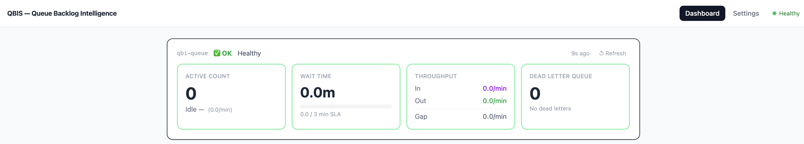
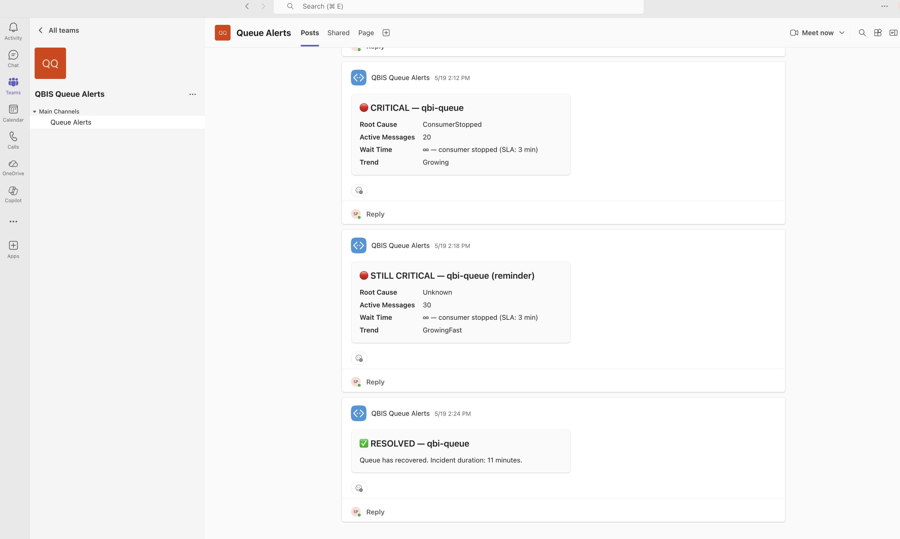
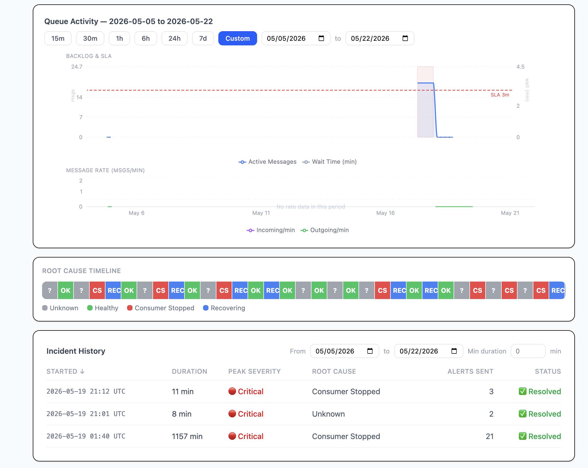
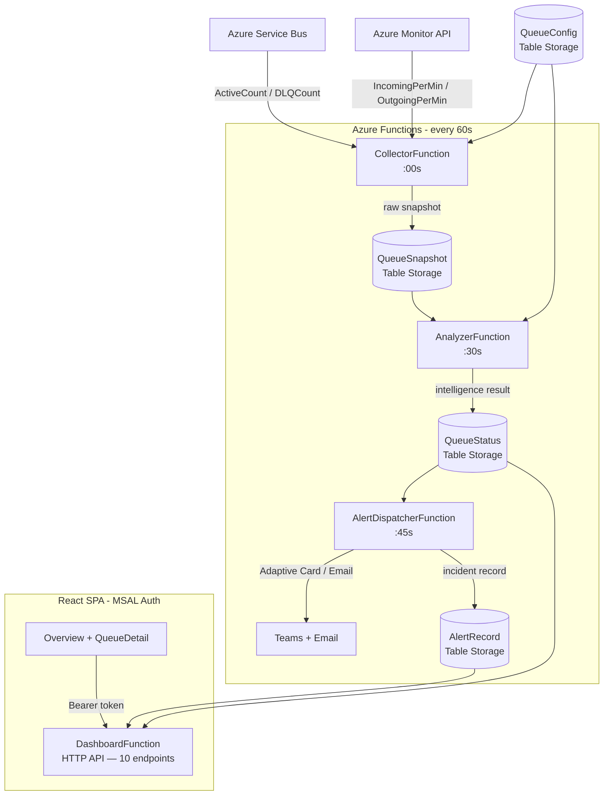

# Queue Backlog Intelligence System

> Real-time monitoring and alerting for Azure Service Bus queues — detects SLA breaches, classifies root causes, and surfaces actionable insights through a live dashboard.


---

## The Problem

When a Service Bus queue backs up, on-call engineers face three hard questions with no fast answers:

- **Is this a real breach or a blip?**
- **Why is it growing — producer spike or consumer failure?**
- **How long until SLA is breached?**

QBIS answers all three automatically, in under 10 seconds on the dashboard.

---

## Screenshots

### Multi-Queue Overview


### Incident Alert Banner


### Historical Chart with Root Cause Timeline


---

## Architecture



> See [docs/ARCHITECTURE.md](docs/ARCHITECTURE.md) for full system design details.

---

## Key Features

| Feature | Description |
|---|---|
| **Multi-Queue Overview** | Health grid with KPI tiles — Total Queues, Queues in Alert, Active Messages, DLQ |
| **SLA Breach Detection** | Warning at 60% · Critical at 100% · Predictive warning before breach |
| **Root Cause Classification** | ConsumerStopped · ProducerSpike · ConsumerSlowdown · DLQGrowth · Recovering |
| **Wait Time Calculation** | Exact minutes a message will wait — `ActiveCount ÷ OutgoingRate` |
| **Trend Detection** | Growing · GrowingFast · Draining · DrainingFast · Stable · Idle |
| **Alert Deduplication** | New · Escalation · Reminder · Recovery — no duplicate noise |
| **Sticky Severity** | Requires 2 consecutive OK readings before de-escalation |
| **Dual Alert Channels** | Microsoft Teams (Adaptive Card + legacy MessageCard) + SMTP email |
| **Authentication** | Azure AD Easy Auth (backend) + MSAL React redirect flow (frontend) |
| **Docker Support** | Single `docker-compose up` runs frontend + backend |

---

## Tech Stack

| Layer | Technology |
|---|---|
| Backend | C# · .NET 8 · Azure Functions v4 Isolated Worker |
| Data | Azure Table Storage · Azure Service Bus Admin API · Azure Monitor |
| Frontend | React 18 · Vite 6 · Recharts · Tailwind CSS v4 · react-router-dom v7 |
| Authentication | Azure AD (Easy Auth) · MSAL React v5 (`@azure/msal-browser`, `@azure/msal-react`) |
| Infrastructure | Docker · nginx · Azure Functions Docker image |
| Alerting | Microsoft Teams Adaptive Cards + legacy MessageCard · SMTP email |

---

## Project Structure

```
QueueBacklogIntelligence/
├── CHANGELOG.md
├── KNOWN_ISSUES.md
├── docker-compose.yml
├── .env.example
│
├── backend/
│   ├── Dockerfile
│   ├── host.json
│   ├── local.settings.json.example
│   ├── Program.cs                           # DI setup, SDK clients, startup table init
│   ├── Functions/
│   │   ├── CollectorFunction.cs             # Timer :00 — collects raw metrics
│   │   ├── AnalyzerFunction.cs              # Timer :30 — runs intelligence pipeline
│   │   ├── AlertDispatcherFunction.cs       # Timer :45 — sends Teams + email alerts
│   │   └── DashboardFunction.cs             # HTTP — 10 REST endpoints + CORS
│   ├── Services/
│   │   ├── CollectorService.cs              # Service Bus Admin API + Azure Monitor
│   │   ├── AnalyzerService.cs               # 9-step intelligence pipeline
│   │   ├── AlertService.cs                  # Teams dual-format + SMTP email dispatch
│   │   ├── Repository.cs                    # Azure Table Storage implementation
│   │   └── IRepository.cs
│   └── Models/
│       ├── QueueConfigEntity.cs
│       ├── QueueSnapshotEntity.cs
│       ├── QueueStatusEntity.cs
│       └── AlertRecordEntity.cs
│
└── frontend/
    ├── Dockerfile
    ├── nginx.conf                            # React Router fallback + /api proxy
    ├── vite.config.js                        # Dev proxy: /api → localhost:7071
    └── src/
        ├── main.jsx                          # Entry: AuthProvider → BrowserRouter → App
        ├── App.jsx                           # Sidebar layout + Routes
        ├── hooks.js                          # useFetch, useInterval, useSecondsAgo
        ├── utils.js                          # trendArrow, rootCauseLabel, fmtDateTime…
        ├── auth/
        │   ├── msalConfig.js                 # MSAL instance + login scopes
        │   ├── AuthProvider.jsx              # Login gate + MsalProvider wrapper
        │   └── useAuthFetch.js               # Returns getAuthHeaders() for every fetch
        ├── pages/
        │   ├── Overview.jsx                  # / — multi-queue KPI tiles + health grid
        │   ├── QueueDetail.jsx               # /queues/:name — single queue drill-down
        │   └── Settings.jsx                  # /settings — queue CRUD
        └── components/
            ├── Sidebar.jsx                   # Fixed dark nav sidebar with health dot
            ├── StatusRow.jsx                 # Live KPI chips + refresh button
            ├── ActiveCountChart.jsx          # Recharts area chart with SLA reference line
            ├── TimeRangeSelector.jsx         # Presets + custom date range (Apply button)
            ├── IncidentBanner.jsx            # Active incident alert bar with breach timer
            ├── RootCauseTimeline.jsx         # Colour-coded cause strip
            ├── IncidentTable.jsx             # Incident history table
            └── QueueForm.jsx                 # Create / edit queue config form
```

---

## Quick Start

### Prerequisites

- .NET 8 SDK
- Azure Functions Core Tools v4 (`npm install -g azure-functions-core-tools@4`)
- Node.js 18+
- Azurite (local Storage emulator) or a real Azure Storage account
- Azure CLI logged in (`az login`) — required for Azure Monitor via `DefaultAzureCredential`

---

### Option A — Local Development

**1. Backend**

```bash
cd backend
cp local.settings.json.example local.settings.json
# Edit local.settings.json — fill in ServiceBusConnectionString
func start
```

Expected startup output:

```
Functions:

    AlertDispatcherFunction: timerTrigger
    AnalyzerFunction:        timerTrigger
    CollectorFunction:       timerTrigger

    CorsOptions:         [OPTIONS] http://localhost:7071/api/{*route}
    CreateQueue:         [POST]    http://localhost:7071/api/queues
    DeleteQueue:         [DELETE]  http://localhost:7071/api/queues/{queueName}
    GetHealth:           [GET]     http://localhost:7071/api/health
    GetQueueAlerts:      [GET]     http://localhost:7071/api/queues/{queueName}/alerts
    GetQueueHistory:     [GET]     http://localhost:7071/api/queues/{queueName}/history
    GetQueues:           [GET]     http://localhost:7071/api/queues
    GetQueueSnapshots:   [GET]     http://localhost:7071/api/queues/{queueName}/snapshots
    GetQueueStatus:      [GET]     http://localhost:7071/api/queues/{queueName}/status
    UpdateQueue:         [PUT]     http://localhost:7071/api/queues/{queueName}

Host started (546ms)
```

All 13 functions (3 timers + 10 HTTP) must appear. If any are missing, check the startup error log.

Verify the backend is healthy:

```bash
curl http://localhost:7071/api/health
```

Expected response:

```json
{
  "status": "Healthy",
  "lastCollectorRunUtc": "2026-07-16T19:03:00.023976Z",
  "lastAnalyzerRunUtc": "2026-07-16T19:03:30.326785Z",
  "collectorDelayMinutes": 0.9,
  "analyzerDelayMinutes": 0.4,
  "message": "All systems operational"
}
```

> `status: "Degraded"` means the Collector or Analyzer hasn't run in over 3 minutes. Check the func start log for errors.

**2. Frontend**

```bash
cd frontend
# Auth disabled for local dev — no login prompt
echo "VITE_API_URL=/api\nVITE_AUTH_ENABLED=false" > .env.local
npm install
npm run dev
```

Expected output:

```
  VITE v6.4.2  ready in 1430 ms

  ➜  Local:   http://localhost:3000/
  ➜  Network: use --host to expose
```

Open **http://localhost:3000** — the Overview page loads with the multi-queue health grid.

---

### Option B — Docker

```bash
cp .env.example .env
# Fill in AzureWebJobsStorage, StorageConnectionString, ServiceBusConnectionString

docker-compose up --build
```

| Service | URL |
|---|---|
| Frontend | http://localhost:3000 |
| Backend API | http://localhost:7071/api |

> **Note:** The Docker frontend image bakes in `VITE_API_URL` from `.env.production` at build time (Azure Functions URL). To use the containerised backend instead, override it with a build arg — see the Docker section in the docs.

---

## Authentication

QBIS uses **Azure AD (Entra ID)** for authentication. The backend is protected by Azure Easy Auth; the frontend uses MSAL React v5.

### How it works

```
Browser (React SPA)
  ├─ loginRedirect() → Microsoft login page
  ├─ After login: acquireTokenSilent() on every API call
  └─ Every request: Authorization: Bearer <token>

Azure Functions host (Easy Auth enabled)
  ├─ Validates JWT before request reaches function code
  ├─ Unauthorized → 401 (function never runs)
  └─ Authorized → function executes normally
```

### Local development

Auth is bypassed entirely when `VITE_AUTH_ENABLED=false` in `.env.local`. The backend is open locally because Easy Auth is an Azure infrastructure feature — it does not exist when running `func start`.

### Required Azure AD setup

1. **Register the API app** (`QBIS-API`) in Azure AD → expose a scope: `access_as_user`
2. **Register the SPA app** (`QBIS-Frontend`) in Azure AD → add redirect URI: `http://localhost:3000` and your production URL
3. **Grant API permission**: QBIS-Frontend → API permissions → QBIS-API → `access_as_user`
4. **Enable Easy Auth** on your Function App: Authentication → Add provider → Microsoft → set to HTTP 401 for unauthenticated requests

### Frontend environment variables

```env
VITE_AUTH_ENABLED=true
VITE_AZURE_CLIENT_ID=<QBIS-Frontend Application (client) ID>
VITE_AZURE_TENANT_ID=<Directory (tenant) ID>
VITE_AZURE_API_SCOPE=api://<QBIS-API client ID>/access_as_user
```

Set these in `frontend/.env.local` (local, gitignored) or in your CI/CD pipeline for production builds.

### Who can log in

By default, any user in your Azure AD tenant can authenticate. To restrict access to specific users or groups: Azure Portal → Enterprise Applications → QBIS-Frontend → Properties → **Assignment required: Yes** → then add users/groups under **Users and groups**.

---

## Azure Setup

### Required resources

- Azure Storage Account — Table Storage for all 4 tables + Functions host state
- Azure Service Bus namespace with at least one queue
- Microsoft Teams incoming webhook (optional — for alerts)
- SMTP credentials (optional — for email alerts)

### Storage tables

Tables are created automatically on startup via `EnsureTablesExistAsync()`. No manual creation needed.

| Table | Purpose |
|---|---|
| `QueueConfig` | Monitoring config per queue (SLA, thresholds, webhook URL) |
| `QueueSnapshot` | Raw metrics written every minute by Collector |
| `QueueStatus` | Analyzed intelligence results written every minute by Analyzer |
| `AlertRecord` | Open and resolved incident history |

### Adding a queue via API

```bash
curl -X POST http://localhost:7071/api/queues \
  -H "Content-Type: application/json" \
  -d '{
    "queueName":         "my-queue",
    "namespace":         "my-servicebus",
    "subscriptionId":    "00000000-0000-0000-0000-000000000000",
    "resourceGroupName": "my-rg",
    "slaMinutes":        15,
    "isEnabled":         true,
    "cooldownMinutes":   10,
    "warningThreshold":  0.75,
    "criticalThreshold": 1.0,
    "teamsWebhookUrl":   null,
    "emailRecipients":   null
  }'
```

Or use the **Settings** page in the dashboard UI.

### Backend environment variables

Set in `backend/local.settings.json` (local) or Azure Function App → Configuration (production):

| Variable | Required | Description |
|---|---|---|
| `ServiceBusConnectionString` | Yes | Full connection string to Service Bus namespace |
| `StorageConnectionString` | Defaults to Azurite | Azure Storage connection string |
| `SmtpHost` | Optional | SMTP server (e.g. `smtp.gmail.com`) |
| `SmtpPort` | Optional | Default: 587 |
| `SmtpUser` | Optional | SMTP username |
| `SmtpPassword` | Optional | SMTP password (use App Password for Gmail) |
| `SmtpFromAddress` | Optional | From address; falls back to `SmtpUser` |

> Azure Monitor authentication uses `DefaultAzureCredential` — no env var needed. Locally, run `az login` first.

---

## API Reference

All endpoints return JSON with camelCase field names. Auth level is `Anonymous` in code — production enforcement is via Azure Easy Auth.

| Method | Endpoint | Description |
|---|---|---|
| GET | `/api/queues` | All queues with config + latest status |
| GET | `/api/queues/{name}/status` | Single queue latest status |
| GET | `/api/queues/{name}/history?minutes=30` | Time-series status history |
| GET | `/api/queues/{name}/snapshots?minutes=30` | Raw metric snapshots |
| GET | `/api/queues/{name}/alerts` | Incident history |
| POST | `/api/queues` | Create queue config |
| PUT | `/api/queues/{name}` | Update queue config |
| DELETE | `/api/queues/{name}` | Delete queue config |
| GET | `/api/health` | System health — last Collector + Analyzer run times |
| OPTIONS | `/api/{*route}` | CORS preflight |

Time range parameters for history endpoints: `?minutes=30` (1–10080) or `?from=<ISO>&to=<ISO>` (max 90-day window).

> Full request/response docs: [docs/API_REFERENCE.md](docs/API_REFERENCE.md)

---

## How the Intelligence Works

The `AnalyzerService` runs a 9-step pipeline every 30 seconds per queue:

1. **ActiveCount deltas** — compute per-minute net change across up to 6 snapshot pairs (Admin API is ground truth)
2. **Dynamic noise floor** — `clamp(ActiveCount × 5%, 1.0, 10.0)` so sensitivity scales with queue size
3. **Queue state classification** — Idle · Draining · Growing · ConsumerStopped · Stable (mutually exclusive, priority ordered)
4. **Outgoing rate derivation** — weighted Monitor rates with consistency check; falls back to ActiveCount delta for pure drains
5. **Wait time + SLA status** — `ActiveCount ÷ OutgoingRate`; `null` when consumer is stopped (honest: infinite wait)
6. **Trend label** — Idle · Stable · Growing · GrowingFast · Draining · DrainingFast
7. **Root cause** — ConsumerStopped · ProducerSpike · ConsumerSlowdown · DLQGrowth · Recovering · Healthy
8. **Alert severity** — None · Warning (≥60% SLA) · Critical (≥100% SLA or consumer stopped); 2-reading sticky de-escalation
9. **NeedToSendAlert** — new incident · escalation · cooldown reminder · recovery (suppresses within-cooldown repeats)

> Full pipeline walkthrough: [docs/ANALYZER_PIPELINE.md](docs/ANALYZER_PIPELINE.md)

---

## Troubleshooting

### `func start` fails: "ServiceBusConnectionString missing"

```
InvalidOperationException: ServiceBusConnectionString missing from local.settings.json.
```

`backend/local.settings.json` does not exist or the key is blank. Copy the example and fill in your real connection string:

```bash
cp backend/local.settings.json.example backend/local.settings.json
# Open and set ServiceBusConnectionString
```

---

### Health returns `"status": "Degraded"`

The Collector or Analyzer hasn't run in over 3 minutes. Check:

1. `func start` log for timer function errors (look for `CollectorFunction failed` or `AnalyzerFunction failed`)
2. `ServiceBusConnectionString` is valid — an invalid string causes the Collector to throw on every run
3. `az login` has been run — `DefaultAzureCredential` used by Azure Monitor fails silently if no credential is found

---

### Azure Monitor rates show `null` for the first few minutes

Expected. Azure Monitor has a 2–4 minute ingestion delay. The Analyzer handles `null` rates gracefully and uses `ActiveCount` deltas as the fallback. Rates will appear after 2–4 minutes of data collection.

---

### Login loop — redirected to Microsoft login repeatedly

If you land back on the login screen after authenticating, the redirect URI is likely mismatched. Check:

1. Azure Portal → App registrations → QBIS-Frontend → Authentication → Redirect URIs
2. Must include the exact origin you're running on (e.g. `http://localhost:3000`)
3. `VITE_AZURE_CLIENT_ID` and `VITE_AZURE_TENANT_ID` in `.env.local` match the registered app

---

### `block_nested_popups` error

This error means a browser blocked an MSAL popup. QBIS uses **redirect flow** (`loginRedirect` / `acquireTokenRedirect`), not popups — this error should not occur. If it does, clear `sessionStorage` in DevTools and reload.

---

### CORS error — `Authorization` header blocked in preflight

```
Request header field authorization is not allowed by Access-Control-Allow-Headers in preflight response.
```

This was fixed in v1.3.2. `AddCors()` in `DashboardFunction.cs` now includes `Authorization` in the allowed headers. Make sure you are on the latest code (`git pull`).

---

### `npm audit` reports vulnerabilities

`npm install` prints audit warnings — these are in dev/build tooling dependencies (Vite, Rollup), not runtime code. They do not affect the running application. Run `npm audit` to inspect; run `npm audit fix` only if the fix is non-breaking.

---

### Dashboard shows "No queues configured"

No rows exist in `QueueConfig` yet. Add a queue via the **Settings** page in the dashboard UI, or via `curl`:

```bash
curl -X POST http://localhost:7071/api/queues \
  -H "Content-Type: application/json" \
  -d '{"queueName":"my-queue","namespace":"...","subscriptionId":"...","resourceGroupName":"...","slaMinutes":15,"isEnabled":true,"cooldownMinutes":10,"warningThreshold":0.75,"criticalThreshold":1.0}'
```

---

## Documentation

- [Architecture & System Design](docs/ARCHITECTURE.md)
- [Analyzer Intelligence Pipeline](docs/ANALYZER_PIPELINE.md)
- [API Reference](docs/API_REFERENCE.md)
- [Changelog](CHANGELOG.md)
- [Known Issues & Limitations](KNOWN_ISSUES.md)

---

## Author

**Shweta Patel**
